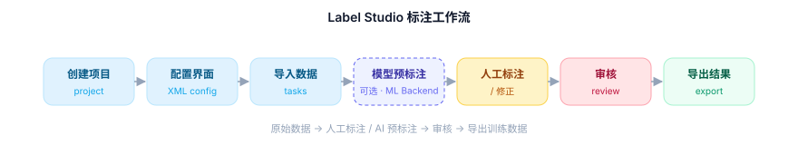
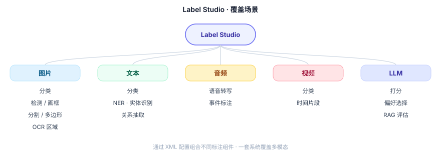
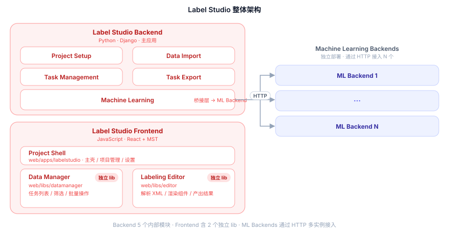
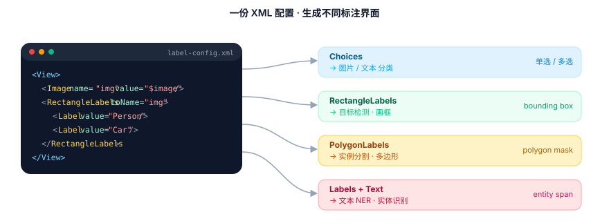
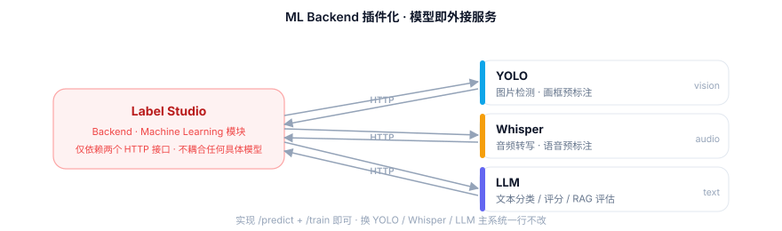
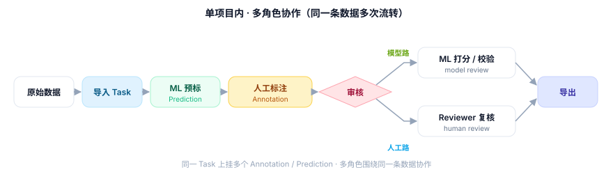
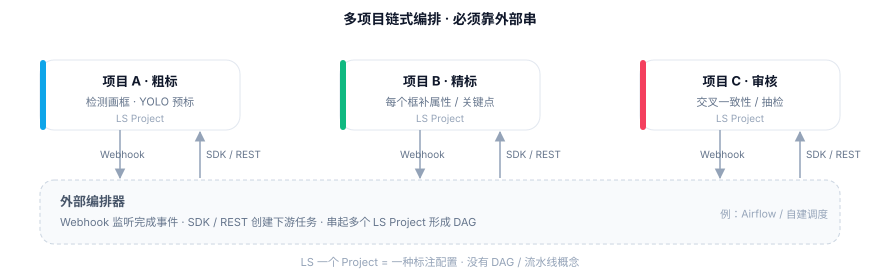

# 技术调研：Label Studio

> 四个模块：**做什么 → 怎么做到 → 关键问答 → 一页速览**

## 一、做什么

Label Studio 是一个开源网页标注工具，用来把图片、文本、音频、视频等原始数据加工成模型训练需要的标注数据。

```text
原始数据 → 人工标注 / AI 预标注 → 审核 → 导出训练数据
```

**标注工作流**（可选 AI 预标注）：



**覆盖场景**：



**适合 vs 不适合**：
它最适合：系统给定一批数据，标注员在网页上完成标注。

| 适合 | 不适合 |
|------|--------|
| 给你数据，你来标 | 你来填表、上传、做业务校验 |
| 标准 AI 标注任务 | 复杂表单 / KYC / 资格审核 |
| 模型预标 + 人工修正 | 完整采集 → 审核 → 导出全链路编排 |

它最适合：系统给定一批数据，标注员在网页上完成标注。最适合标注任务，不适合做数据采集任务。最合适做标准的标注任务，不适合做复杂的业务逻辑处理。

## 二、怎么做到的

**架构**：Backend（Django · 5 个内部模块） + Frontend（含 2 个独立 lib） + 数据 / 文件存储 + N 个 ML Backend（HTTP 接入）。



**官方[模块划分](https://labelstud.io/guide/get_started#Architecture)**：

| 模块 | 技术 | 路径 | 作用 |
|------|------|------|------|
| **Label Studio main app** | Python + **Django** | `HumanSignal/label-studio` | 主后端 · 项目 / 任务 / 用户 / 导入导出 / Webhook |
| **Label Studio frontend** | **React** + **MST** | `web/apps/labelstudio` + `web/libs/editor` | 前端整合点；`web/libs/editor` 是真正的标注界面，独立 lib 可嵌入 |
| **Data Manager** | **React** | `web/libs/datamanager` | 任务列表 / 筛选 / 批量操作，独立 lib 可嵌入 |
| **ML Backends** | **Python**（HTTP 服务） | `HumanSignal/label-studio-ml-backend` | 模型预标 / 训练 · 独立部署 · 多实例接入 |
| 存储 | DB（SQLite / Postgres） + 文件 / 对象存储（本地 / S3 / GCS / Azure） | — | 结构化数据 + 原始素材 |

几个值得注意的点：

- **Backend 是单体 Django**：5 个内部模块（Project Setup / Data Import / Task Management / Task Export / Machine Learning）打包在一起，其中 Machine Learning 是与外部 ML Backends 通信的桥接层。
- **Editor 用 MST**：标注状态是一棵可观察的状态树，XML 配置解析后即对应一个 MST store，组件订阅它来渲染和提交结果。这是“配置生成界面 + 结果格式统一”能落地的关键。
- **Editor / Data Manager 是独立 lib**：放在 `web/libs/` 下，可单独打包嵌入到其它产品。
- **ML Backends 单独仓库 + 多实例**：通过 HTTP 接入 N 个，换模型只改这层。

它的核心是**三个关键设计**：

### 1) 用 XML 配置生成界面

一段配置决定一种标注任务，不用为每个任务写新页面：

```xml
<View>
  <Image name="img" value="$image"/>
  <RectangleLabels name="label" toName="img">
    <Label value="Person"/>
    <Label value="Car"/>
  </RectangleLabels>
</View>
```



### 2) 统一的结果格式

画框、圈词、评分等都用同一种结构 `{from_name, to_name, type, value}`，下游导出 / 审核 / 训练只需写一套处理逻辑。

**核心思想**：无论前端交互形态如何变化（画框、圈词、评分），标注产出都归一到同一种数据协议。

**示例对比**：

```javascript
// 画框
{ from_name: "label", to_name: "img", type: "rectanglelabels", value: { x: 10, y: 20, width: 100, height: 80, rectanglelabels: ["person"] }}

// 圈词
{ from_name: "label", to_name: "text", type: "labels", value: { start: 5, end: 12, labels: ["LOC"] }}

// 评分
{ from_name: "rating", to_name: "img", type: "rating", value: { rating: 4 }}
```

**统一后的收益**：

| 下游环节 | 没有统一格式 | 有统一格式 |
|----------|-------------|-----------|
| **导出** | 画框一套代码、圈词一套代码、评分一套代码 | 一个解析器，按 `type` 分发转换 |
| **审核** | 每新增标注类型都要改审核界面 | 审核界面只认统一结构，`type` 决定渲染方式 |
| **训练** | 每个模型配一个数据加载器 | 一个 DataLoader 读取所有标注 |

**一句话**：新增标注类型（如多边形、语音切分），只需在前端 XML 配置里声明新组件，下游导出/审核/训练**一行代码不用改**。数据协议不变，流程自由编排。

### 3) ML Backend 插件化

模型通过 HTTP 接口外接，换 YOLO / Whisper / LLM 都不动主系统。

## 三、关键问答

**Q1. XML 配置的本质是什么？**

一份**声明式 UI 描述**，借用 XML 语法表达一棵**组件树**：标签 = 组件、属性 = 参数/数据绑定、嵌套 = 布局。前端有固定组件库（Image、Choices、RectangleLabels、Rating ...），XML 只是“点菜”，组件库负责渲染。

**Q2. 为什么这套设计能覆盖那么多标注任务？**

因为做了**三件解耦**，举例说明：

**① 数据 ↔ 界面解耦**

数据只描述“是什么”，界面只描述“怎么标”，两边互不依赖。

```text
数据：{ "image": "https://.../cat.jpg" }
界面 A：<Image value="$image"/> + <Choices>      → 做图片分类
界面 B：<Image value="$image"/> + <RectangleLabels> → 同一张图改成画框
```

同一批图片，今天分类、明天画框，**只换界面配置，不动数据**。

**② 界面 ↔ 任务解耦**

“换一种标注任务”不需要写新页面、新接口、新存储，只换一段 XML：

```xml
<!-- 任务：图片分类 -->
<Choices name="cls" toName="img">
  <Choice value="Cat"/><Choice value="Dog"/>
</Choices>

<!-- 改一行就变成：图片画框 -->
<RectangleLabels name="box" toName="img">
  <Label value="Cat"/><Label value="Dog"/>
</RectangleLabels>
```

新增一种标注任务的成本 ≈ 写一段 XML，而不是开发一个新页面。

**③ 模型 ↔ 系统解耦**

模型不写在 LS 里，而是独立的 HTTP 服务，实现两个接口：

```text
POST /predict   传入一条 Task → 返回 Prediction
POST /train     传入一批标注  → 触发训练
```



今天接 YOLO，明天换 Whisper，后天接 LLM，**主系统一行代码不用改**。

**Q3. 优点 vs 局限**

| 优点 | 局限 |
|------|------|
| 新任务 = 新配置，不用写页面 | 只擅长“标注动作”，不擅长业务流程 |
| 结果格式天然统一，便于导出/训练 | 复杂交互、动态表单要扩展组件 |
| 模型预标注与人工结果同构 | 全链路（采集/审核/分流）要靠外部系统 |
| 模型可替换 (YOLO/Whisper/LLM) | 部署偏重 (Django + 前端 + ML Backend) |

**Q4. 一个项目里能做多任务编排吗？**

不能做“任务 A 输出 → 任务 B 输入”这种链式编排。LS 里 **一个 Project = 一种标注配置**，没有 DAG / 流水线概念。

概念对照：

| 通常说的 | LS 里对应 |
|----------|-----------|
| 任务 / 工作流节点 | **Project**（一个标注配置） |
| 一条待处理数据 | **Task** |
| 模型预标注 | **Prediction** |
| 人工标注 | **Annotation** |
| 审核 | 多 Annotation / Reviewer 角色（企业版原生） |

**单项目内**支持围绕同一条数据的多角色混排（原始数据 / 预标注 / 人工 / 模型审核 / 人工审核）：



**多项目链式编排**靠外部串起来：Webhook + Python SDK / REST API，或接 Airflow / 自建 Pipeline Manager。



一句话：**单项目内多角色协作 OK，跨项目流水线要外部编排。**

## 四、一页速览

| 维度 | 答案 |
|------|------|
| 是什么 | 开源网页标注工作台 |
| 核心流程 | 建项目 → 配界面 → 导数据 → 标注 → 审核 → 导出 |
| 适合 | 图片 / 文本 / 音频 / 视频 / LLM 评估等标准标注 |
| 不适合 | 复杂表单、业务校验、全链路编排 |
| 关键设计 | XML 配置生成界面、统一结果格式、ML Backend 插件化 |
| 最值得学 | 配置驱动 UI、结果结构化、模型服务解耦 |

