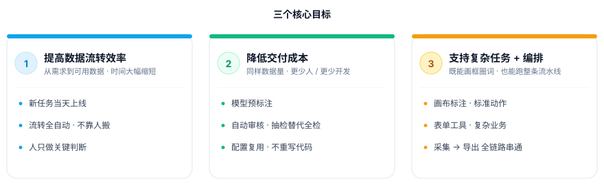
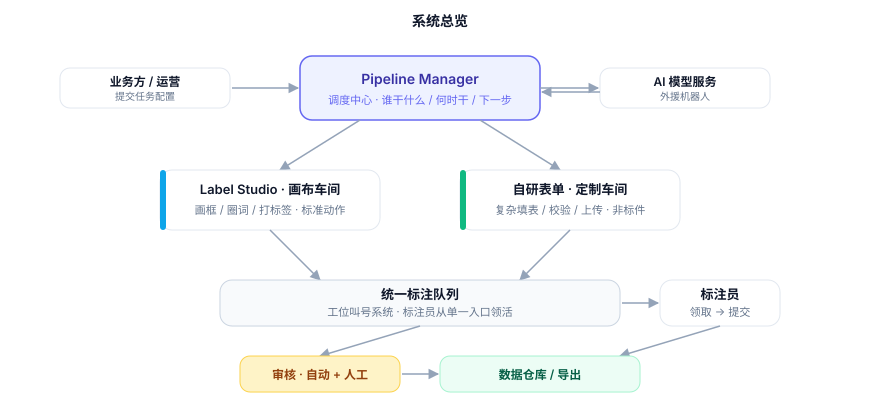
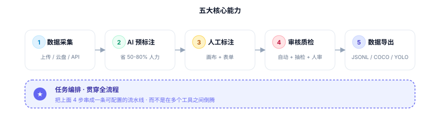
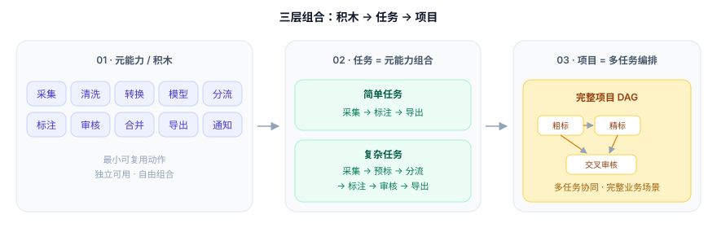
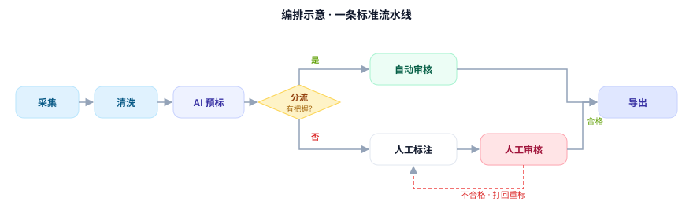
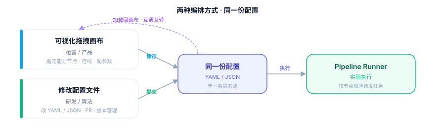
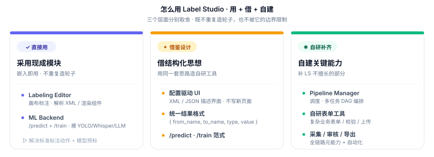
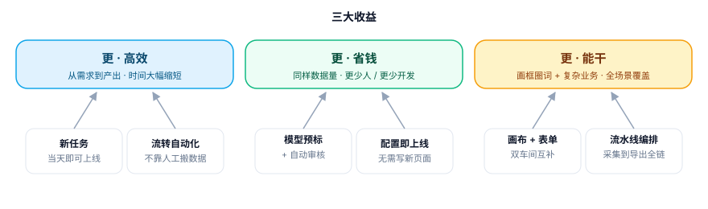

# 标注系统总览

## 一、三个核心目标



<!-- | 目标 | 意思 | 衡量 |
|------|------|------|
| **① 提高数据流转效率** | 从"接到需求"到"产出可用数据"的时间大幅缩短 | 新任务上线时间、平均每条数据流转时长 |
| **② 降低交付成本** | 同样的数据量，需要更少的人 / 更少的开发 | 单位数据成本（人力 + 研发摊销） |
| **③ 支持复杂标注 + 编排** | 既能做画框圈词这种"标准动作"，也能做采集+预标+审核+导出的"整条流水线" | 覆盖的任务类型数、多步骤任务占比 | -->

## 二、系统长什么样

用一句话解释：

```text
一个指挥中心（Pipeline Manager）
  + 两个标注车间（Label Studio 画布 / 自研表单）
  + 一队外援（AI 模型）
```



几个角色用"工厂"来类比：

| 系统组件 | 工厂类比 |
|----------|---------|
| **Pipeline Manager** | 调度中心：谁干什么、什么时候干、干完下一步是什么 |
| **Label Studio 画布** | 标准车间：画框、圈词、打标签这种成熟工种 |
| **自研表单工具** | 定制车间：复杂填表、校验、上传这种"非标件" |
| **AI 模型服务** | 外援机器人：能先干一遍，省下大量人力 |
| **标注员队列** | 工位叫号系统：工人从一个入口按优先级领活 |
| **数据仓库** | 成品库：按标准格式存好，随时出库 |

## 三、五大核心能力



### 1) 数据采集

从各种来源**把数据收进来**：上传、S3/云盘、API、爬虫、客户交付。采集时统一打上标签，方便后面追踪。

### 2) AI 预标注

在人工动手之前，**先让模型干一遍**：

- 模型有把握的直接走自动审核，人不用看。
- 模型没把握的交给人，但人看到的是"模型已经画好的初稿"，只需要改错。

一般能省掉 **50-80%** 的人工时间。

### 3) 人工标注

两种车间各司其职：

- **标准动作** → Label Studio（成熟、稳定、覆盖图文音视频）。
- **复杂业务** → 自研表单（多级联动、异步校验、文件上传防重等）。

标注员在**一个队列**里领活，不用在多个系统之间切换。

### 4) 审核：自动 + 人工

不是所有数据都要人来审核。分三档：

| 数据质量信号 | 处理方式 |
|--------------|---------|
| 模型置信度高 + 规则通过 | **自动审核**，直接入库 |
| 置信度中等 / 可疑 | **抽检**：按比例抽一部分给人审 |
| 置信度低 / 发现问题 | **全量人工审核**，不合格打回重标 |

省出来的人力集中在真正需要判断的 case 上。

### 5) 任务编排

把采集、预标、标注、审核、导出串成**一条可配置的流水线**，而不是让人在多个工具之间倒腾。

#### 元能力 = 流水线上的「积木块」

系统把数据生产过程拆成一组**最小动作**，每一块都能独立用，也能组合：

| 元能力 | 干什么 | 举例 |
|--------|--------|------|
| **采集（collect）** | 把数据收进来 | 上传、对象存储拉取、API 拉取 |
| **清洗（clean）** | 去重 / 过滤 / 脱敏 | 去重复图片、去黑名单文本 |
| **转换（transform）** | 格式 / 切片 / 抽取 | OCR、视频抽帧、字段映射 |
| **模型（model）** | AI 预标注或推理 | YOLO 画框、Whisper 转写、LLM 分类 |
| **分流（route）** | 按条件走不同分支 | 置信度高走 A，低走 B |
| **标注（annotate）** | 人工标注 | 画布标注 / 表单采集 |
| **审核（review）** | 自动 + 人工质检 | 抽检、规则、金标、LLM 审核 |
| **合并（merge）** | 多分支结果汇合 | 多人标注一致性合并 |
| **导出（export）** | 数据出库 | JSONL、COCO、YOLO、CoNLL |
| **通知（notify）** | Webhook / 消息 | 完成通知、异常告警 |

#### 三层组合：积木 → 任务 → 项目



- **简单任务**：一两块积木就能跑通。例如「采集 → 导出」、「采集 → 人工标注 → 导出」。
- **复杂任务**：多块积木组合。例如「采集 → 预标注 → 分流 → 人工标注 → 审核 → 导出」。
- **完整项目**：多个任务串成一张图，处理一个完整业务场景。例如先批量画框检测，再对每个框做属性补标，再做交叉审核。



#### 两种编排方式



| 方式 | 适合谁 | 操作 |
|------|--------|------|
| **可视化拖拽编辑** | 运营 / 产品 | 在画布上拖元能力节点、连线、配参数；保存即生效 |
| **修改配置文件** | 研发 / 算法 | 改 YAML/JSON 配置，提交 PR、走版本管理；适合复杂分支和复用 |

两种方式背后是**同一份配置**，互通互转：拖出来的图能导出成配置，配置也能加载回画布。

#### 每一步都看得见

整条流水线上**任意节点**都可以查看：

- 这一步**输入了什么**数据（图片 / 文本 / 已有标注 ...）
- 处理过程中**走了哪个分支**、用了什么参数
- 这一步**输出了什么**结果

用来排查问题、回溯责任、做样本审计都很方便。

#### 关键运行机制

- **自动按条件分流**：模型说"有把握"走 A 路，"没把握"走 B 路。
- **人工标注期间流水线自动挂起**，人一提交就继续往下走。
- **不合格数据自动打回重标**，不用人去手动搬。

#### 关于数据格式

- **自研标注**：既支持 **Label Studio 的 XML 配置**（兼容画布生态），也支持**自研模板**（更适合复杂表单），但所有标注产出都要遵从我们统一的**数据结构协议**（`from_name / to_name / type / value` + 业务字段），下游的审核、统计、导出才能复用同一套逻辑。
- **训练数据**：协议数据是**生产中间格式**，**不一定能直接喂给大模型训练**——通常还需要再做一次转换（拼成 SFT/RLHF 需要的对话格式、或转成 COCO/YOLO/CoNLL 等训练框架格式）。这一步由 `export` 元能力承担，按目标用途单独配置。

## 四、对 Label Studio 的取舍

上面的「画布车间」从哪儿来？我们对 Label Studio 这套体系做了三层取舍——既不重复造轮子，也不被它的边界限制。



- **用** `Labeling Editor` + `ML Backend`——画布标注与模型预标已经成熟，嵌入即用。
- **借** 配置驱动 UI、统一结果格式 `{from_name, to_name, type, value}`、`/predict` · `/train` 服务范式——把同一套思路下沉到自研表单与调度协议。
- **建** Pipeline Manager、自研表单工具、采集 / 审核 / 导出等元能力——补齐 LS 不擅长的全链路环节。

## 五、能带来什么收益



| 维度 | 现在 | 建成后 |
|------|------|--------|
| 新任务上线 | 研发 1-2 周开发调试测试 | 写一份配置，当天可上线 |
| 任务流转 | 人在 N 个系统之间搬数据 | 一条 pipeline 自动串起来 |
| 人工成本 | 每条数据都靠人标 + 人审 | 模型预标 + 自动审核，人只做关键判断 |
| 质量透明度 | 只能看"最终结果" | 每条数据的每一步都有记录、可追溯、可打回 |
| 扩展新能力 | 改代码、发版本 | 注册一个新后端 / 新模型即可 |

一句话：**让研发专注平台能力，让运营专注业务配置，让标注员专注标注本身。**

## 六、推进节奏

> 详见 [03-phase1a-prd.md](./03-phase1a-prd.md)

## 七、关键问答

**Q. 为什么不用完整的 Label Studio 来做编排？**

**核心原因：避免双系统**。我们有大量高度定制的业务流程（KYC / 资格审核 / 复杂表单 / 跨步骤校验），LS 的 XML + Editor 模型**承接不了**——只能再开一套自研系统接住，结果是**数据 / 队列 / 审核 / 审计被切成两半**，标注员还要在两个系统之间切换。一套统一系统才能覆盖标准与定制。

支撑这个判断的技术原因：

- **LS 是工作站，不是编排引擎**：一个 `Project = 一种标注配置`，没有 DAG / 任务依赖 / 重试 / 触发器；多项目要靠外部 Webhook + SDK 串，编排能力本来就不在 LS 内部。
- **节点粒度只到「标注」**：`collect / clean / transform / route / merge / export / notify` 这些元能力 LS 都不暴露成可调度节点。
- **数据形态只懂标注**：`{from_name, to_name, type, value}` 是为标注产出设计的，pipeline 里的中间产物（清洗列表、路由决策、合并状态、通知 payload）没地方放。
- **改 LS 代价大于另起**：单体 Django 强耦合，扩成调度中心要永久跟主线分叉；轻量 Pipeline Manager + 节点协议几百行就能跑，且与 Editor / ML Backend 正交解耦。

一句话：LS 解决「标注怎么标得好」，Pipeline Manager 解决「全流程怎么跑得通」——两件事不该挤在同一个系统里。

## 八、一句话总结

```text
把"每个页面单独开发 + 人工串流程"
升级为
"一份配置生成任务 + 一条流水线自动流转"
```

目标是：**又快、又省、又能干复杂活**。
