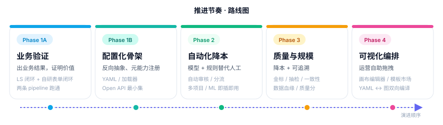

# 推进节奏 与 Phase 1A PRD

> 版本：v0.1（草稿）
> 角色：开发=1 人，业务方=自己（内部验证）
> 上位文档：[02-system-overview.md](./02-system-overview.md)

---

## 〇、推进节奏总览



> **当前约束**：1 人开发，业务方=自己（内部验证），LS Editor + ML Backend 复用，其余自研。
> Phase 1 拆为 1A（业务验证）+ 1B（配置化骨架）。

### 阶段总览

| 阶段 | 目标 | 关键动作 |
|------|------|---------|
| **Phase 1A · 业务验证闭环** | 用最短路径出业务结果，证明价值 | 极简 PM（项目/任务/状态机，硬编码线性流程）；LS 闭环（图像检测，YOLO 预标 + 人工修正 + 简化审核 + COCO 导出）；自研表单闭环（1 个业务表单模板，复用 frontend 组件）；最小内部接口（不做 Open API） |
| **Phase 1B · 配置化骨架** | 基于已验证的 2 条 pipeline 反向抽象 | YAML/JSON 配置 schema；元能力注册（collect/pre-annotate/annotate/review/export）；配置加载器；Open API 最小集；配置版本管理 |
| **Phase 2 · 自动化降本** | 模型 + 规则替代人工 | 自动审核（阈值+规则+LLM）；分流节点（route）；表单引擎升级（条件/级联/异步校验）；ML Backend 注册即插即用；多项目支持 |
| **Phase 3 · 质量与规模化** | 降成本、可追溯 | 金标 / 抽检 / 一致性 / 标注员质量分；数据血缘；返工闭环；质量看板 |
| **Phase 4 · 可视化编排** | 运营自助 | 画布拖拽编辑器；YAML ↔ 图双向编译；模板市场；运行监控与断点回放；Webhook 通知 |

### Phase 1A 验收（量化）

- LS 闭环：相比纯人工标注，**单图标注时间下降 ≥40%**
- 自研表单闭环：从配置到产出首批数据 **≤3 天**
- 两条 pipeline 端到端无人工 DB 操作

### Phase 1B 验收

- 第 3 条 pipeline **只通过写配置**就能上线，无需改代码
- Open API 可被外部脚本完成「创建项目→上传数据→拉取结果」全链路

### 开发纪律

- **先写死、再抽象**：Phase 1A 不允许任何配置化
- **每个里程碑可演示**：每完成一个里程碑必须有可演示产出，不允许长期闷头开发
- **进度复盘**：仓库根目录维护 `progress.md`，每完成一个里程碑更新一次
- **范围优先于细节**：UI 可以简陋，功能可以缺失，但里程碑顺序和验收不放松
- **关键模块亲手 review**：状态机、协议层、配置 schema 必须逐行 review
- **强制单测**：状态机 + 数据协议必须有单测

---

# Phase 1A PRD

## 一、目标

用最短路径跑通 **2 条端到端 pipeline**，证明系统对核心目标（效率 / 成本 / 复杂编排）的价值，**不做配置化、不做 Open API、不做多用户**。

---

## 二、范围

### In Scope

- 极简 Pipeline Manager：项目 / 任务 / 状态机 / 挂起恢复
- 闭环 A：基于 LS Editor 的图像检测标注
- 闭环 B：基于自研表单的业务数据采集
- 复用现有 LS + YOLO docker-compose
- 复用现有 frontend 表单组件（来自 codattaFrontierWebsite）
- 简化审核（人工通过/打回）
- 数据导出（COCO + JSONL）

### Out of Scope（明确不做）

- ❌ 配置化编排（YAML/JSON pipeline 定义）→ Phase 1B
- ❌ Open API → Phase 1B
- ❌ 多用户 / 权限 / SSO → Phase 2+
- ❌ 自动审核 → Phase 2
- ❌ 分流 / 合并 / 复杂 DAG → Phase 2
- ❌ 看板 / 报表（用 SQL 查询代替）
- ❌ Webhook / 通知 → Phase 1B
- ❌ 数据血缘可视化 → Phase 3
- ❌ 标注员管理 / 质量分 → Phase 3

---

## 三、闭环 A · LS 图像检测

### 业务场景

对一批图片做目标检测标注，YOLO 先预标，标注员修正，简化审核后导出 COCO。

### 输入

- **数据**：图像批次，本地目录或对象存储
- **配置**：标签集（如 person/car/truck）、ML Backend 地址（YOLO）

### 处理流程

```
collect(本地/S3) → pre-annotate(YOLO) → annotate(LS Editor) → review(人工) → export(COCO)
```

### 输出

- COCO 格式 JSON 文件 + 图片
- 仅导出 review 通过的标注

### 验收指标

- 至少跑通 1 个真实图像批次（**≥100 张**）
- 单图标注时间相比纯人工 **下降 ≥40%**
- 端到端无人工 DB 操作

---

## 四、闭环 B · 自研表单业务数据

### 业务场景

业务方提交多字段表单（含文本、单选、文件上传），系统记录、简化审核、导出 JSONL。

### 输入

- **数据**：业务方手动填报或 API 推送任务
- **配置**：1 个表单模板（**硬编码**，不做配置化）

### 处理流程

```
collect(API/手动) → annotate(自研表单) → review(人工) → export(JSONL)
```

### 输出

- JSONL 文件，每行一条提交记录 + review 状态

### 验收指标

- 至少跑通 1 个真实业务批次
- 从「需求确认」到「首批数据交付」**≤3 天**
- 表单字段类型至少支持：text / select / file

---

## 五、Pipeline Manager 最小数据模型

```
Project
  - id, name, type (ls_detection | custom_form), status, created_at

Task
  - id, project_id, status, current_step, payload, result, created_at, updated_at
  - status: pending | pre_annotating | annotating | reviewing | approved | rejected | exported
  - current_step: 当前所在的 pipeline 步骤名

Annotation
  - id, task_id, version (draft | submitted), data (JSON), submitted_at

Review
  - id, task_id, action (approve | reject), reason, reviewed_at

ExportRecord
  - id, project_id, format, file_path, exported_at, task_count
```

> Phase 1A **不抽象 Step / Pipeline 表**，pipeline 流程**硬编码在代码里**。1B 再抽象。

---

## 六、对外接口（Phase 1A 仅内部调用）

| 动作 | 接口形式 | 说明 |
|---|---|---|
| 上传数据 | CLI 脚本 | `python import.py --project=xxx --dir=./images` |
| 创建任务 | CLI 脚本 | 或自动从 import 触发 |
| 打开标注 | Web 页面 | `/annotate/:task_id`（LS Editor 嵌入 / 自研表单页） |
| 审核 | Web 页面 | `/review/:task_id` |
| 导出 | CLI 脚本 | `python export.py --project=xxx --format=coco` |
| 查询状态 | SQL 直连 | 不做看板 |

---

## 七、技术选型（M0 spike 决定）

- **LS Editor 嵌入方式**：优先 `label-studio-frontend` npm 包直嵌（备选 iframe）
- **PM 后端**：复用现有 Python 栈（参考 `pipeline_manager/` 已有目录结构），Web 框架 FastAPI
- **存储**：SQLite（单人单机够用）；预留 PostgreSQL 切换接口
- **前端**：复用 codattaFrontierWebsite 的 React + Tailwind + 表单组件经验

---

## 八、里程碑拆分

> 按交付内容拆分，不按时间。每个里程碑独立可演示、可验收。完成一个推进下一个。

### M0 · 技术选型与骨架

- [ ] LS Editor 嵌入 spike：`label-studio-frontend` npm 包在 React 中加载 XML 配置 + 接收 submit 事件
- [ ] PM 仓库初始化：FastAPI + SQLite + Alembic + 基础目录结构
- [ ] 数据模型落地：Project / Task / Annotation / Review / ExportRecord 五张表 + 迁移
- [ ] 状态机模块：所有状态转移规则代码化 + 单测覆盖
- [ ] 本 PRD 定稿，待确认事项全部清空

**演示**：CLI 创建一个 Project，插入一条 Task，手动触发状态转移走完一遍。

### M1 · LS Editor 嵌入页

- [ ] `/annotate/:task_id` 页面：加载 XML 配置 + 图片 URL + predictions（先用假数据）
- [ ] Editor submit 事件回调 PM API，写入 Annotation 表
- [ ] 提交后 Task 状态自动转移到 `reviewing`

**演示**：浏览器打开任务页，画几个框，点 Submit，DB 里能看到标注结果。

### M2 · 闭环 A 数据流（YOLO 预标 → LS）

- [ ] `import.py`：扫描本地图片目录，批量创建 Task，状态置为 `pending`
- [ ] `pre-annotate` worker：调用现有 YOLO ML Backend `/predict`，结果存为 `Annotation(version=draft)`
- [ ] Task 状态自动 `pending → pre_annotating → annotating`
- [ ] M1 的标注页加载 draft annotation 作为 predictions

**演示**：CLI 导入 10 张图，浏览器打开任意一张，能看到 YOLO 预标的框。

### M3 · 审核页 + 打回闭环

- [ ] `/review/:task_id` 页面：展示提交后的标注结果 + 通过/打回按钮 + 打回原因输入框
- [ ] 通过：Task → `approved`
- [ ] 打回：Task → `annotating`，原 Annotation 标记为 `rejected`，标注员重新进入修正流程
- [ ] 待审核任务列表页（最简表格）

**演示**：标注一张图 → 审核员打回 → 标注员重新修正 → 审核通过。

### M4 · 闭环 A 导出

- [ ] `export.py --format=coco`：拉取 `approved` 状态的 Task + Annotation，转换为 COCO JSON
- [ ] 写入 ExportRecord 表
- [ ] 校验：导出的 COCO 能被标准工具正确解析

**演示**：导出一个 COCO 文件，用现成 COCO 可视化工具打开，框位置正确。

### M5 · 闭环 A 真实批次验证

- [ ] 接入真实图像批次（≥100 张）
- [ ] 端到端跑：导入 → 预标 → 标注 → 审核 → 导出
- [ ] 记录人均标注时长，与纯人工对比
- [ ] 验收 1A 闭环 A 指标：单图标注时间下降 ≥40%

**演示**：完整流程跑一遍，给出效率对比数据。

### M6 · 自研表单壳页面

- [ ] `/form/:task_id` 页面：复用 codattaFrontierWebsite 表单组件
- [ ] 1 个硬编码业务模板：包含 text / select / file 三种字段类型
- [ ] 提交回 PM API，写入 Annotation 表
- [ ] 字段级校验（必填、格式）

**演示**：打开表单页，填写，提交，DB 看到结果。

### M7 · 闭环 B 数据流 + 审核 + 导出

- [ ] 任务创建：API 推送 / CLI 批量创建
- [ ] 复用 M3 的审核页（兼容表单类标注的展示）
- [ ] `export.py --format=jsonl`：每行一条提交记录 + review 状态

**演示**：API 推一批任务，业务方填表，审核，导出 JSONL。

### M8 · 闭环 B 真实批次验证

- [ ] 接入 1 个真实业务批次
- [ ] 端到端跑通
- [ ] 验收 1A 闭环 B 指标：从需求确认到首批数据交付 ≤3 天

**演示**：完整流程跑通，交付数据可被下游使用。

### M9 · 联调 + 复盘

- [ ] 两条 pipeline 在同一套 PM 实例下并行运行
- [ ] 修复联调发现的问题
- [ ] 写 1A 复盘文档：哪些抽象错了 / 哪些可以提前 / 1B 该如何抽象
- [ ] 输出 1B 配置 schema 设计输入

**演示**：1A 收口报告。

---

## 九、风险与对策

| 风险 | 应对 |
|---|---|
| LS Editor 嵌入方式选错 | M0 必须出 spike 结论，定型后不变 |
| 过度抽象 | 严守"先写死再抽象"，1A 不允许任何配置化 |
| 范围蔓延 | 每个里程碑结束做一次范围 review，超出立即砍 |
| 自己当业务方需求模糊 | 本 PRD 在 M0 结束前定稿，之后不大改 |
| 闭环 A/B 互相阻塞 | 严格按 M0→M9 顺序推进，A 不通不开 B；M5 卡住时 B 可降级（砍字段类型） |

---

## 十、待确认事项

- [ ] 闭环 A 的真实图像批次来源（哪个业务的数据？）
- [ ] 闭环 B 的业务表单具体字段（≥1 份字段清单）
- [ ] LS Editor 嵌入方式的最终选型（M0 spike 结论）
- [ ] PM 后端语言/框架确认（建议 Python + FastAPI，与 ml-backend 一致）
