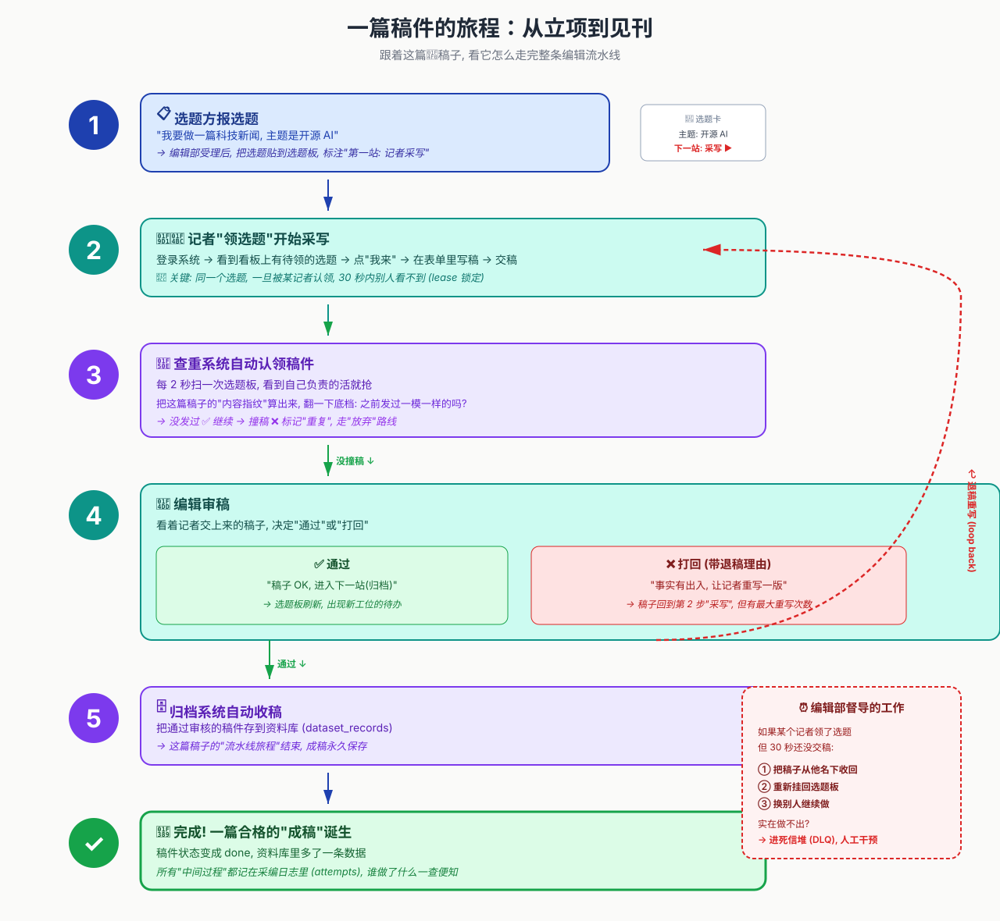
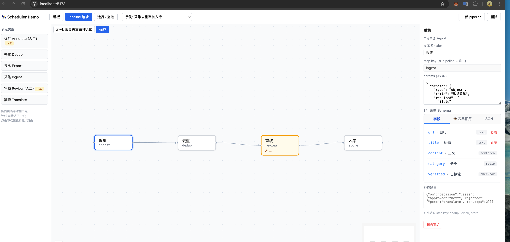
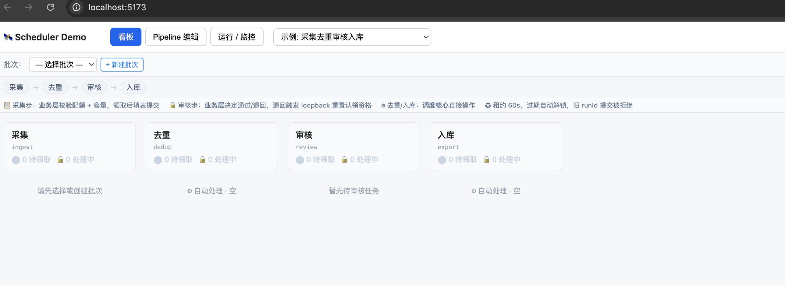
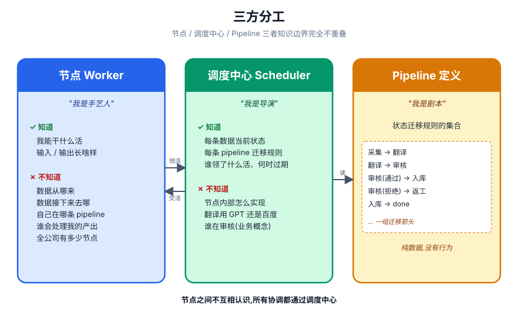
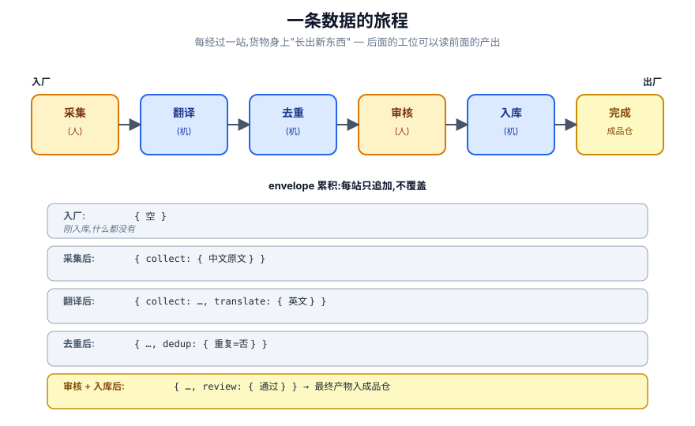
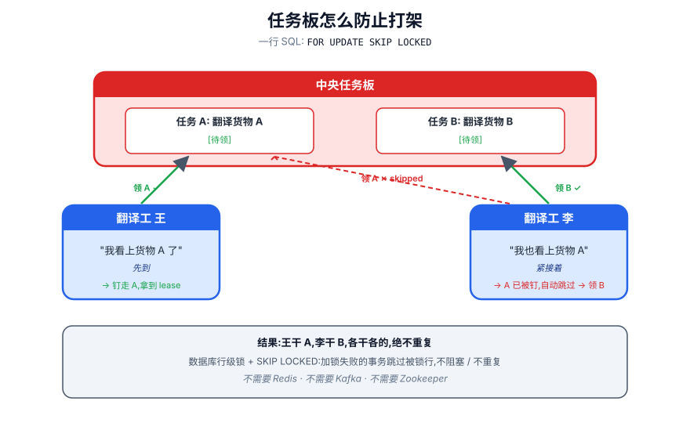
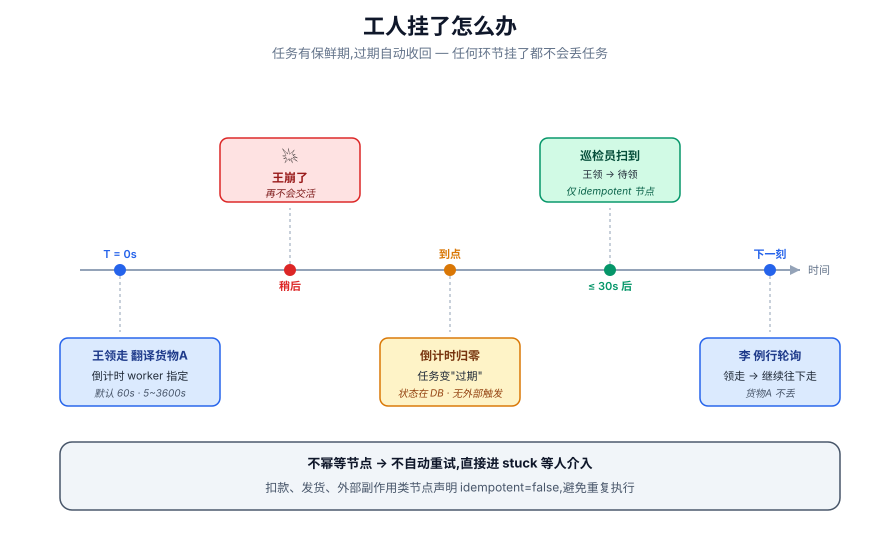
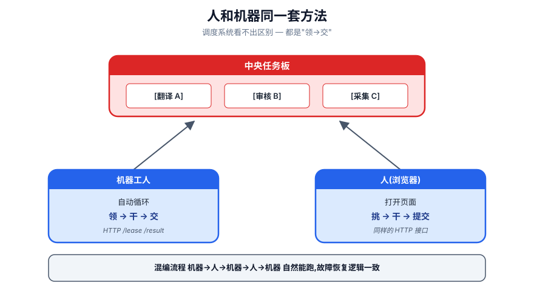
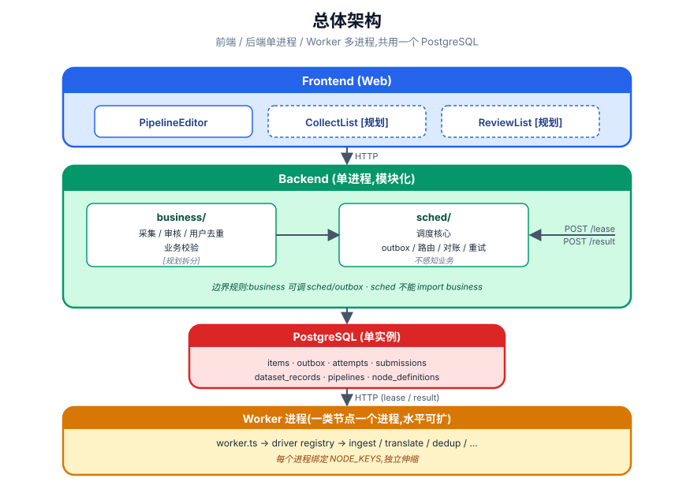
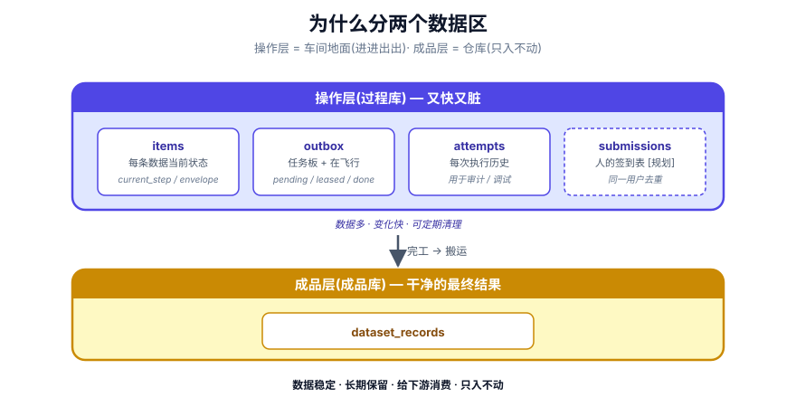

# 调度中心 · 设计总览

> 一句话：让一条数据从原料到成品**按规则、不漏、不重、可恢复**地跑完。  
> 机器自动加工（去重 / 入库）+ 人工参与（填表 / 审核）**走同一套机制**。

---

## 一、先建立直觉：编辑部比喻

把系统想象成一家**报社编辑部**：

> 选题 → 写稿 → 查重 → 审稿 → 归档，督导员每 30 秒巡视谁拖稿。



对应到流水线：`入厂 → 采集 → 去重 → 审核 →（退回则回第一步）→ 入库 → 完成`。  
任何环节挂掉，**1 分钟内自动收回换人**。

---

## 二、系统长什么样

### 2.1 Pipeline 编辑器



左侧拖工位、中间连成流程、右侧配置参数 / 表单 schema / 拒绝路由。  
**改流程图 = 改剧本，不动一行代码。**

### 2.2 批次看板



每个工位实时显示 `[待领 / 处理中]`。  
顶部说明各步谁来调度：**采集/审核走业务层**（校验配额、决定通过/退回），**去重/入库走调度核心**（直接处理）。

---

## 三、三个角色：谁是谁

| 角色 | 比喻 | 职责 |
|---|---|---|
| **工位（Worker）** | 手艺人 | 我能干啥（翻译 / 去重 / 网页表单） |
| **调度中心（Scheduler）** | 导演 | 数据当前在哪步、剧本怎么走 |
| **流程图（Pipeline）** | 剧本 | 本身不动，只定义规则 |

三者知识边界完全不重叠。调度只贴活，工位例行扫板拿走——**广播 + 订阅**。



---

## 四、一条数据的完整旅程



每经过一站，货物身上都"长出新东西"，下游能读上游所有产出：

| 阶段 | 数据状态 |
|---|---|
| 入厂 | `{ 空 }` |
| 采集后 | `{ collect: { 中文原文 } }` |
| 翻译后 | `{ collect: ..., translate: { 英文 } }` |
| 去重后 | `{ ..., dedup: { 重复=否 } }` |
| 审核后 | `{ ..., review: { 通过 } }` |
| 入库后 | 最终产物 → 成品仓库 |

---

## 五、四大关键机制

### 5.1 任务板：怎么防止抢活打架



核心魔法：`SELECT ... FOR UPDATE SKIP LOCKED`  
同一行任务只能被一根钉子钉走——**数据库原子领取，不需要 Redis / Kafka**。

### 5.2 租约：工人挂了怎么办



- 工人领活时钉一个**倒计时牌子**（默认 60s，工人自定）
- 到点不交差，巡检员（Reconciler，每 30s 扫一次）收回，重新贴板
- 重试用尽进失败队列（DLQ），等人介入

**任务有保鲜期，过期自动收回，任何环节挂了都不会丢任务。**

### 5.3 路由：怎么决定下一步

配置驱动，调度核心**不解读语义**，只看产出字段命中哪个 case：

```jsonc
{
  "on": "decision",
  "cases": {
    "duplicate": { "goto": "ingest", "maxLoops": 3 },
    "rejected":  { "goto": "ingest", "maxLoops": 3 },
    "approved":  "next"
  },
  "default": "next"
}
```

优先级：`output._nextHint` > `step.routes` > `step.defaultNext` > `done`

### 5.4 人和机器同一套接口



- 机器工人：自动循环 `领 → 干 → 交`
- 人工工人：打开网页 `挑 → 干 → 提交`

调度系统**看不出区别**，都是"领 → 交"。混编流程 `机器 → 人 → 机器 → 人 → 机器` 自然能跑，故障恢复逻辑一致。

---

## 六、系统架构全景



```
前端 ──HTTP──▶ 后端 (单进程)
                ├─ 业务层：批次 / 配额 / 用户 / 采集审核页面
                ├─ 调度核心：任务板 / 路由 / 重试 / 巡检
                └─ 自动工位 + 巡检员
                        │
                        ▼
                   PostgreSQL
```

### 6.1 分层边界

| 关注点 | 调度核心 | 业务层 | 前端 |
|---|---|:---:|:---:|
| 队列、租约、超时、路由 | ✅ | | |
| 节点定义、Pipeline CRUD | ✅ | | |
| 历史 attempts、DLQ | ✅ | | |
| output 形状存储 | ✅ | | |
| output 语义解读 | | ✅ | ✅ |
| 用户、配额、批次 | | ✅ | |
| 谁能领下一份 | | ✅ | |
| 渲染、交互、提示 | | | ✅ |

### 6.2 数据分层



| 层级 | 表 | 特点 |
|---|---|---|
| **操作层（过程库）** | `items / outbox / attempts / submissions` | 数据多、变化快、可定期清理 |
| **成品层（成品库）** | `dataset_records` | 数据稳定、长期保留、给下游消费 |

---

## 七、设计原则

| 原则 | 具体体现 |
|---|---|
| **高内聚** | 调度只做流转，业务只做配额，前端只做交互 |
| **低耦合** | 业务层用 HTTP 调调度核心，不读核心表；调度不知道用户、批次 |
| **配置驱动** | routes / params_schema 让同一引擎跑不同流程，不改代码扩流水线 |
| **黑盒输出** | output 是 JSON，调度只看路由命中，不解读语义 |
| **失败优先** | lease 超时 → 收回，重试有上限，兜底进 DLQ |
| **幂等优先** | 自动节点必须幂等，才允许超时重试 |
| **状态显式** | items / outbox / attempts 三张表把"现在/排队/历史"分得清清楚楚 |

---

## 八、常见疑问

### 8.1 定位与职责

**Q. 调度核心和业务层为啥分两层？**  
调度业务无关，换条流水线一行不改。业务层用 HTTP 调调度核心，不直读核心表。

**Q. 为啥不写死流转，要配置驱动？**  
调度不解读语义，只看产出字段对照映射跳。**改流程不用改代码。**

**Q. 人和机器为啥同一套接口？**  
回收逻辑统一（关页面 = 工位挂），也方便流程任意混编。

### 8.2 核心概念

**Q. 两个工位抢同一份活？**  
数据库原子领取（`FOR UPDATE SKIP LOCKED`），只一个能抢到。

**Q. 同一人能重复做同一份活吗？**  
正在做的不能再领第二次（唯一索引兜底）；已交差 / 退回的不算。

**Q. "重做"和"新任务"系统看得出区别吗？**  
看不出。都是新单子，旧单子的提交一律拒。

### 8.3 关键机制

**Q. 工位挂了？**  
领活时钉一分钟牌子，过期巡检员收回换人。重试用尽进失败队列。

**Q. 数据被拒后？**  
回到第一步，任务板贴新单，谁有资格谁来抢（不绑定原作者）。

**Q. 重复请求会重复执行吗？**  
不会。带 Idempotency-Key，系统识别后返回上次响应。

**Q. 排查问题怎么定位？**  
每个请求一个 ID 贯穿同步入口和异步副作用，grep 一行复盘整条链路。

### 8.4 并发与一致性

**Q. 多 Reconciler 实例怎么不打架？**  
`pg_try_advisory_lock(9527)` 全局锁，同一时刻只有一个实例在干活。

**Q. /result 接口是不是事务性的？**  
是。`sql.begin` 包住：写 attempts → 改 outbox → 改 items → 写下一步 outbox。**全成功或全回滚。**

### 8.5 扩展与演进

**Q. 加新工位要改什么？**  
写工位 + 改剧本插一行，**老工位完全不动**。

**Q. 一个进程，以后能拆服务吗？**  
预留好开关。改两个 env、各发一把 API key，**代码一行不动**。

**Q. 为啥不用 Kafka / Redis？**  
当前规模数据库够用，且事务一致。需要时换 Kafka 只动一个文件。

### 8.6 还没做的

多租户隔离、流程图版本钉死、限流、历史归档、Prometheus 监控。

---

## 附录

- [01-design.md](./01-design.md) — 设计细节(分层 / 数据模型 / 机制 / 决策)
- [02-api.md](./02-api.md) — 接口使用说明
- [03-testing.md](./03-testing.md) — 测试用法
- [06-node-design.md](./06-node-design.md) — 功能节点协议 / 版本 / 运行方式 / 管理后台设计
