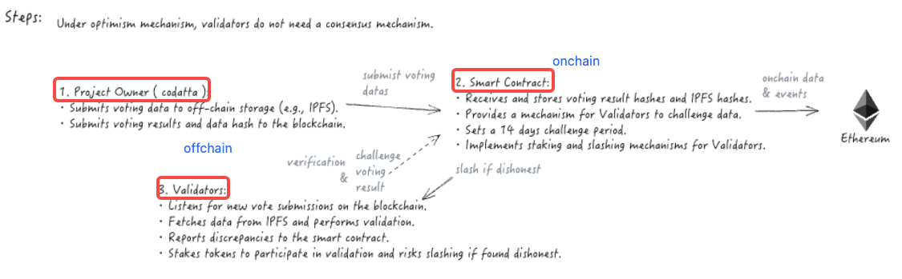
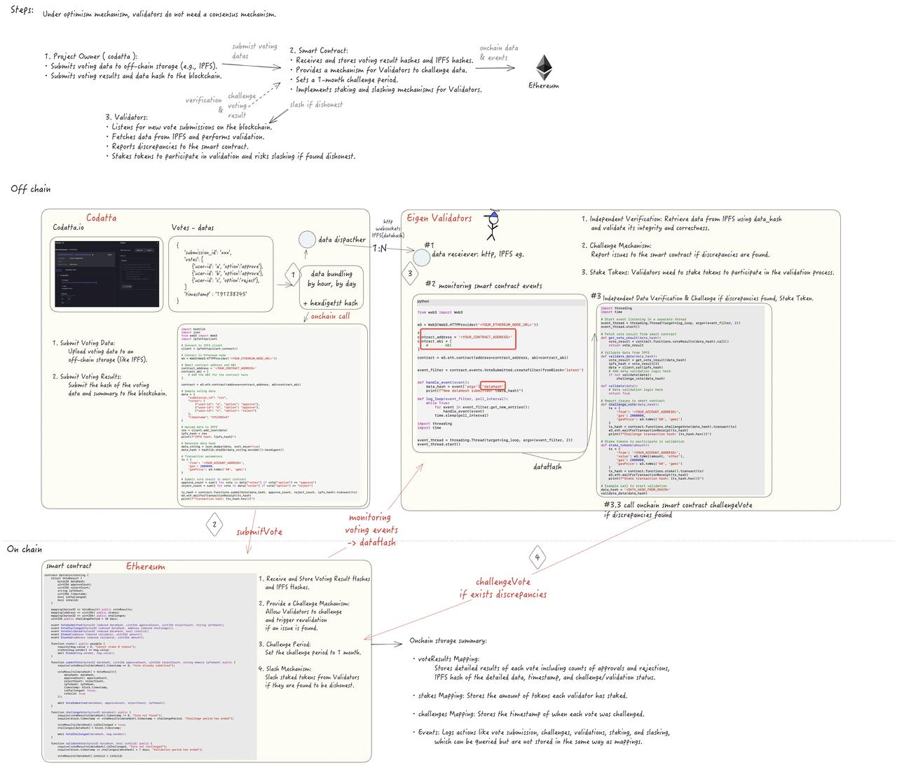

# Voting digest onchain with eigenlayer 

This repo show the process for codatta voting digest onchain.

### 1. Voting data example: 
{ 
    'submission_id': 'sid123', 
    'votes': [
        {'user-id': 'a', 'option':'approve'}, 
        {'user-id': 'b', 'option':'approve'}, 
        {'user-id': 'c', 'option':'reject'}
    ]
    'timestamp' : 1719915084
}

### 2. Prosper ( codatta eg. ) :
  1. Submits voting data to on-chain storage ETH blob for compressed detail voting data, ETH calldata for voting summary : approve_count,reject_count,voting_result,data_hash eg.
  2. Submits voting results and data hash to the blockchain.

### 3. Smart Contract:
  1. Receives and stores voting data and result hashes and hashes, and compressed data package.
  2. Provides a mechanism for Validators to challenge data.
  3. Sets a 1-week challenge period.
  4. Implements revalidation from ETH blob data.
  5. Implements staking and slashing mechanisms for Validators.

### 4. Validators:
  1. Listening to new vote submissions on blockchain.
  2. Fetches data from ETH blob and performs validation.
  3. Reports discrepancies to the smart contract.
  4. Stakes tokens to participate in validation and risks slashing if found dishonest.

### 5. Incentives for operators：
  1. Issue a project reward token.
  2. Periodically incentivize participants in the on-chain contract and reward effective challenges.

###6. Flowchart diagram: 

